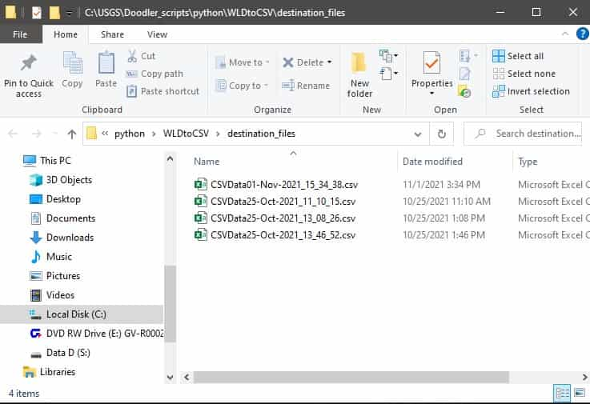

# PythonWLDtoCSV

## Description
The WLDtoCSVConverter is a program meant to take specific data from .xml, .jpg, .wld files and place it in a csv file.
The files to be processed must be in the same directory and the .xml, .jpg, .wld files that are intended to be used together must all have the same name.
For instance, files dog.jpg dog.xml and cat.wld will not be processed since WLDtoCSVConverter doesn't know if these files' data is related to each other. A valid set of files has the same names for instance tiger.jpg tiger.xml and tiger.wld will be processed.

## Contents of the CSV file
Each row of the CSV file will contain the following information about each set of xml,jpg,and wld files
  1. image filename,
  2. Easting min (XMin),
  3. Easting max (XMax),
  4. Northing min (YMin),
  5. Norhting max (YMax),
  6. Coordinate Reference System (e.g. wgs 84 / utm zone 18N).

# WLDtoCSVConverter Instructions
1. Click "Select Folder" and this will open a system file dialog where you will select the directory containing all your .xml, .jpg, and .wld files
- :bangbang: You will not see your files when open the location containing you files. Its okay! The files are just hidden.

### How the Folder Looks in Your directory

### How the Folder Looks in WLDtoCSVConverter

- Its normal not to be able to see the files when you open the folder with the converter. The files are present, but hidden. The valid files will appear in the listbox on the right side of the application.

2. Select the location where you want to store the csv file that will be generated using the "Select Folder to Store Results" button.
3. Click "Run" to convert your files into a csv file.
4. If a csv file is successfully created you will see a pop up like below.

5. Click "Open Result" to see the csv file you created.

6. :confetti_ball: You're done! :confetti_ball:
